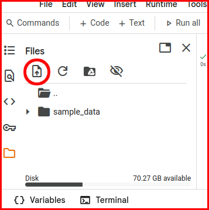

# Reading and writing files

## Learning Objectives:

* Reading and writing files.
* Built in functions `open()` and `write()`
* Numpy's `np.loadtxt()` and `np.savetxt()`
* Pandas' `DataFrame`

## Overview

Colab is a web-based cloud-service hosted by Google accessible via a web-browser. Therefore, any files you would like to read needs to be uploaded to Colab workspace of your session. Files you create or write to are stored on your workspace of your Colab session. Those files are only temporarily stored. If you close your session (e.g. closing browser tab), all your data and files will be lost.


### Uploading and downloading local files

To uploaded and download local files you can click on the folder on the left hand side. This is the workspace of your Colab session. 



Select the "upload" option (circled icon) and chose the files you would like to upload. If you right click or select the 3 vertical dots next to the file, you will be able to download the file.

At the bottom left you can also see an icon "{} Variables", which shows your, and an "Terminal" icon, which will open a Linux terminal. The "Variables" can be very useful, when you debug your code.
 
### Uploading files hosted on Websites

The Colab cloud-service uses Linux. So Linux commands can be used to handle data. To upload data from Blackboard or website in general you can use the command `wget`. Linux commands within your code cell are executed with a "!" in front of the command.

```bash
!wget <link>
```

`<link>` is the place holder for a web link, for example:

```bash
!wget https://raw.githubusercontent.com/jbestenlehner/mat1820_example/refs/heads/main/data/somefile.txt #uploads the file to your Colab session
!ls               # lists files in your Colab session
!cat somefile.txt # shows the content of your file
```
Note: `ls`, `cat` or any other Linux command can be also used in the Terminal, when you open on the Terminal.

## Reading and writing text files

Python provides built-in functions for creating, writing, and reading files.

### Creating a new files

To create a new file in Python, the function `open()` is used with one of the following parameters:

- `'w'` - writes - : `open('myfile.txt', 'w')` will create a new file if the specified file does not exists or **overwrite** an existing file.
- `'a'` - append - : `open('myfile.txt', 'a')` will create a new file if the specified file does not exists or **append** to an existing file.
- `'x'` - create - : `open('myfile.txt', 'x')` will create a new  file or returns an error if the file exists.

Note: files are temporarily created and written to your Colab session. They will be lost, if you close the session.

### Reading a file line by line

To open a file in _read only_ the parameter `'r'` is used with the function `open()`. 

```python
 #uploads the file to your Colab session
!wget https://raw.githubusercontent.com/jbestenlehner/mat1820_example/refs/heads/main/data/somefile.txt
file = open('somefile.txt', 'r')
```
This creates an iterable object and we can read in the file line by line with a loop:

```python
for line in file: # reads the file line by line
    print(line)   # prints each line
file.close()      # closes the file
```
The `\n` at the end of the line indicates a new line as discussed in the previous tutorial in session 4.

The following example shows how to read file, creates list of its content and converts the list into a numpy array.  The example uses the function `.strip()` which returns a copy of the string with leading and trailing whitespace removed including new line (`\n`) and the function `.split()`, which returns a list of the substrings in the string, using `sep` as the separator string. If no separator string is given, the string will split on any white space character including new line (`\n`) and tab (`\t`).

```python
import numpy as np

file = open('somefile.txt', 'r') # opens file in read-only.
data = []                        # creates and empty list
for line in file:                # reads the file line by line
    line = line.strip()          # strips leading and trailing whitespace
    line = line.split()          # splits the string into substrings at each white space
    data.append(line)            # appends the list line to the list data
data = np.array(data)            # converts list to numpy array
print(data.shape)                # shape of array in lines and columns
print(data)
```

Note: `.split()` is used for data that has been intentionally delimited (structured data).

### Writing to a file

Before we can write into a file we need to create it first, e.g. `open('myfile.txt', 'w')` (see [creating a new file](#creating-a-new-files)).

```python
file = open('myfile.txt', 'w')           # creates a new file called myfile.txt or overwrites it, if it already exists.
for i in range(1,4):                     # produces range 1, 2, 3
    a_string = (f'Line {i+1:.0f}\n')     # creates a string and formats indexes i into string 
    file.write(a_string)                 # writes string into file
file.close()                             # closes the file
```

Note: `'\n'` (new line) needs to be added at the end of the string. Unlike `print()` the `.write()` function does not add by default a `\n` to the end of the string. If `\n` is not added, all strings will be written into the same line.

:::{warning}

File must be closed after writing the data, e.g. `file.close()`. If the file is not closed properly, not all data might be written to the file.

:::

## Numpy: reading and writing text files

Structured data generally refer to formats that store data in an organized and consistent way making it easier to read and manipulate. 

### Reading text files

The _numpy_ function `np.loadtxt()` is usually used to read in numerical data of data type `int` or `float`, while `float` is the default data type (`dtype`).

```python
!wget https://raw.githubusercontent.com/jbestenlehner/mat1820_example/refs/heads/main/data/some_data.txt
a = np.loadtxt('some_data.txt') # reads the entire content of the file into an numpy.array of dtype = float.

b = np.loadtxt('some_data.txt', dtype = int) # reads data into a numpy.array of dtype = int

c = np.loadtxt('some_data.txt', dtype = str) # reads data into a numpy.array of dtype = str
```
The `delimiter` parameter tells `np.loadtxt()`, which character separates the data. Input is `str`, e.g. `','` or `'|'`. Default is whitespace.

In cases, where you do not need all columns, you can select columns with the `usecols=` parameter. Input can be an integer or a sequence (0, 2, 4).

Note: Python starts counting at 0.

```python
d = np.loadtxt('some_data.txt', usecols=(0,3)) # reads in 1st and 4th column

column_2, column_3 = np.loadtxt('some_data.txt', usecols=(1,2), unpack=True) # reads in 2nd and 3rd column into 1D arrays
```

The `unpack=True` parameters unpacks the array into individual columns. Therefore, you need to know, how many columns do you unpack.

Some files have comments at the start of the file. The usual convention is that file comments or headers start with `'#'` (default). Input to the `comments` parameter are `str` or sequence of `str`. Alternatively you can use the parameter `skiprows` with an integer input.

```python
e = np.loadtxt('some_data.txt', usecols=4, delimiter=' ', comments=':', skiprows = 2, unpack=True)
```

Summary of optional parameters to `np.loadtxt()`:

- dtype: `int`, `float` (default) or `str`
- delimiter: `str`
- usecols: `int` or sequence of `int`
- comments: `str` or sequence of `str` (default `'#'`)
- skiprows: `int`
- unpack: `bool` (default `False`)

There are more options available, which can be accessed with `np.loadtxt?` or `help(np.loadtxt)`.

### Writing text files

To save data in a text file _numpy_ provides the `np.savetxt()` function.

```python
a = np.random(10,5)*10 # generate random numbers between 0 and 10 excluding 10, [0, 10), in 10 row times 5 column matrix.
np.savetxt('save_some_data.txt', a) # writes array a into a file
```
It can save 1D or 2D (our example) array. If you multiple arrays you would like to save into one file you need to concatenate them first, e.g. `np.concatenate()`, `np.column_stack()`, `np.row_stack()`, etc.

Of course you can format your data with the `fmt` parameter.

```python
np.savetxt('save_some_data.txt', a, fmt='%10.5f') # all columns are formatted the same
np.savetxt('save_some_data.txt', a, fmt='%8.2f %5.2f %7.3f %3.0f %10.2e') # or individually
```
Note: You need to use `%` instead of `:`.

Other optional parameters are:
- delimiter: `str`
- header: `str`
- comments: `str`

A full list of parameters can be accessed with `np.savetxt?` or `help(np.savetxt)`.

## Pandas: reading and writing data files

Structured data files like `.CSV`, `.JSON`, `.XML`, etc. can contain numerical as well as text data including data labels. For example, a data file might contain names of people (`str`), their ages (`int`) and height (`float`). 'Name', 'Age' and 'Height' are data labels. Of course this can be down with the methods above by using `.split()` or `unpack` and then individually assign the data types to the lists/arrays and define variable according the data contents (name, age, height).

However, there is package called <a href="https://pandas.pydata.org/" target="_blank">pandas</a>, which is a python package develop for real-world Data Analysis. It is able to handle the vast majority of typical use cases in finance, statistics, social science and many areas of engineering providing fast, flexible and expressive data structures designed to make working with relational or labeled data both easy and intuitive. Pandas is able to read many different data files including CSV, JSON, XML, SQL, Excel, HTML, clipboard, etc.

Pandas is imported with

```python
import pandas as pd
```

In this session we mainly use Pandas to read in and out data files. The next semester will focus more on Data Analysis, where we will explore more the capabilities of Pandas.

While Numpy is used for numerical computations Pandas strength lies in data handling and analysis, which makes it the goto package in Data Science.  

### Reading writing files with Pandas

Pandas reads tables of data into a pandas `DataFrames`.

```python
import pandas as pd
!wget https://raw.githubusercontent.com/jbestenlehner/mat1820_example/refs/heads/main/data/bio_stats.csv

df = pd.read_csv('bio_stats.csv') # reads in a CSV file

print(df)                         # displays the content of DataFrame. 
```
For large datasets only the first 5 and last 5 rows are shown while first and last few columns are displayed depending on screen width.

Note: there is an additional 'index' column counting from 0.

```python
print(df.columns)   # displays columns name
print(df.dtypes)    # displays columns data types
print(df.shape)     # displays number of rows and columns

df.to_csv('bio_stats_out.csv', index=False) # writes data into CSV excluding the index column
```

By default `index=True` and the index column will be written out as well. An overview of available file formats can be found <a href="https://pandas.pydata.org/docs/user_guide/io.html" target="_blank">here</a>.

### A few Pandas examples

Below we show a few examples to briefly look at the data with some basics statistics. As you might have noticed the 'bio_stats.csv' file contains height and weight data in SI units (m and kg).

Accessing, selecting subsets and sorting columns of a `DataFrame`:

```python
print(df['Age'])              # accesses and displays the Age column
print(df[['Name', 'Sex']])    # accesses and displays Name and Sex (list of column labels)
print(df.sort_values(by='Name')) # sorts the df according there Age
print(df['Name'].sort_index(ascending=False)) # sorts Names in descending index order.
```

